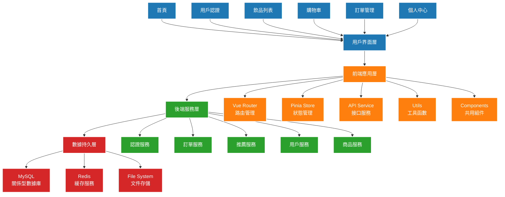

# 飲料店點餐推薦系統

這是一個使用 Vue.js 和 Flask 建構的現代化飲料店點餐推薦系統，提供直觀的用戶界面和強大的後端支持。

## 🌟 系統特色

- 📱 響應式設計，支援多種設備
- 🔐 安全的用戶認證系統
- 🎯 個人化飲品推薦
- 💫 即時訂單追蹤
- 📊 詳細的銷售分析
- ⭐ 用戶評分與評論
- ❤️ 個人收藏功能

## 🔰 系統架構圖



### 系統層級說明

1. **用戶界面層**
   - 響應式設計，支援多種設備訪問
   - 現代化 UI/UX 設計
   - 直觀的用戶操作流程

2. **前端應用層**
   - Vue 3 組件化開發
   - Pinia 狀態管理
   - Vue Router 路由管理
   - Axios 請求封裝
   - 共用組件庫

3. **後端服務層**
   - RESTful API 設計
   - JWT 認證授權
   - 業務邏輯處理
   - 數據驗證和轉換
   - 錯誤處理和日誌

4. **數據持久層**
   - MySQL 數據存儲
   - Redis 緩存服務
   - 文件系統存儲

### 核心功能流程

1. **用戶認證流程**
   ```mermaid
   sequenceDiagram
       participant U as 用戶
       participant F as 前端
       participant B as 後端
       participant D as 數據庫

       U->>F: 輸入登錄信息
       F->>B: 發送認證請求
       B->>D: 驗證用戶信息
       D-->>B: 返回用戶數據
       B-->>F: 返回 JWT Token
       F-->>U: 登錄成功提示
   ```

## 🛠 技術棧

### 前端
- Vue 3
- Vite
- TailwindCSS
- Pinia 狀態管理
- Vue Router
- Axios

### 後端
- Python 3.11
- Flask + Flask-OpenAPI3
- MySQL 8.0
- SQLAlchemy
- JWT 認證
- OpenAPI/Swagger

## 🚀 部署指南

### 1️⃣ 本地開發環境部署

#### A. 傳統部署方式

1. **克隆專案**
```bash
git clone https://github.com/Mark850409/20250127_VueWithFlask.git
```

2. **前端設置**
```bash
# 進入前端目錄
cd frontend

# 安裝依賴
npm install

# 啟動開發服務器
npm run dev
```

3. **後端設置**
```bash
# 進入後端目錄
cd backend

# 創建虛擬環境
python -m venv venv

# 啟動虛擬環境
# Windows
venv\Scripts\activate
# Linux/Mac
source venv/bin/activate

# 安裝依賴
pip install -r requirements.txt

# 設置環境變數
cp .env.example .env.development
# 編輯 .env.development 文件設置必要參數
```

4. **數據庫設置**
```bash
# 創建數據庫
mysql -u root -p < scripts/init.sql

# 執行數據庫遷移
flask db upgrade
```

5. **啟動服務**
```bash
# 啟動後端服務
python app.py
```

#### B. Docker 部署方式

1. **安裝 Docker 和 Docker Compose**
   - 從 [Docker 官網](https://www.docker.com/products/docker-desktop) 下載並安裝 Docker Desktop
   - Docker Compose 通常包含在 Docker Desktop 中

2. **配置環境變數**
```bash
# 複製環境變數範例檔
cp .env.example .env

# 編輯 .env 文件設置必要參數
```

3. **使用 Docker Compose 啟動服務**
```bash
# 構建並啟動所有服務
docker-compose up --build

# 在背景執行
docker-compose up -d

# 查看服務狀態
docker-compose ps

# 查看服務日誌
docker-compose logs -f
```

4. **訪問服務**
   - 前端：http://localhost:8080
   - 後端 API：http://localhost:5000
   - Swagger 文檔：http://localhost:5000/openapi/swagger

5. **常用 Docker 命令**
```bash
# 停止服務
docker-compose down

# 重新構建並啟動特定服務
docker-compose up --build <service-name>

# 查看容器日誌
docker-compose logs -f <service-name>

# 進入容器內部
docker-compose exec <service-name> bash
```

### 2️⃣ 生產環境部署

#### A. 傳統部署方式

1. **服務器要求**
   - Ubuntu 20.04 LTS 或更高版本
   - 4GB RAM 以上
   - 2 核心 CPU 以上
   - 30GB SSD 存儲空間

2. **安裝必要軟件**
```bash
# 更新系統
sudo apt update && sudo apt upgrade -y

# 安裝必要套件
sudo apt install -y nginx mysql-server python3-venv nodejs npm
```

3. **部署前端**
```bash
# 構建前端
cd frontend
npm install
npm run build
```

5. **部署後端**
```bash
# 設置 Python 虛擬環境
cd backend
python3 -m venv venv
source venv/bin/activate
pip install -r requirements.txt

# 配置 Gunicorn
gunicorn -w 4 -b 127.0.0.1:5000 app:app
```

#### B. Docker 生產環境部署

1. **使用生產環境配置文件**
```bash
# 複製生產環境配置
cp .env.example .env.production
cp docker-compose-prod.yml docker-compose.yml

# 編輯生產環境變數
nano .env.production
```

2. **啟動生產環境服務**
```bash
# 使用生產環境配置啟動服務
docker-compose -f docker-compose-prod.yml up -d

# 查看服務狀態
docker-compose -f docker-compose-prod.yml ps
```

3. **配置 Nginx 反向代理**
```nginx
server {
    listen 80;
    server_name your-domain.com;

    location / {
        proxy_pass http://frontend:8080;
        proxy_set_header Host $host;
        proxy_set_header X-Real-IP $remote_addr;
    }

    location /api {
        proxy_pass http://backend:5000;
        proxy_set_header Host $host;
        proxy_set_header X-Real-IP $remote_addr;
    }
}
```

### 3️⃣ Azure 雲端部署

#### A. 使用 Azure Container Apps

1. **安裝 Azure CLI 並登入**
```bash
# 安裝 Azure CLI
curl -sL https://aka.ms/InstallAzureCLIDeb | sudo bash

# 登入 Azure
az login
```

2. **創建資源組**
```bash
# 設置變數
RESOURCE_GROUP="drink-order-system"
LOCATION="eastasia"

# 創建資源組
az group create --name $RESOURCE_GROUP --location $LOCATION
```

3. **創建 Azure Container Registry (ACR)**
```bash
# 創建 ACR
ACR_NAME="drinkordersystem"
az acr create --resource-group $RESOURCE_GROUP \
    --name $ACR_NAME --sku Basic

# 登入 ACR
az acr login --name $ACR_NAME
```

4. **構建並推送 Docker 映像**
```bash
# 構建映像
docker build ^
  --build-arg VITE_API_URL=https://backend-recommend-app.azurewebsites.net/api ^
  --build-arg VITE_BACKEND_URL=https://backend-recommend-app.azurewebsites.net ^
  --build-arg VITE_AUTOGEN_API_URL=https://mynocodbapi.zeabur.app ^
  --build-arg VITE_JINA_API_URL=https://deepsearch.jina.ai/v1/chat/completions ^
  --build-arg VITE_JINA_API_KEY= VITE_JINA_API_KEY ^
  --build-arg VITE_MISTRAL_API_URL=https://api.mistral.ai/v1/chat/completions ^
  --build-arg VITE_MISTRAL_API_KEY=VITE_MISTRAL_API_KEY ^
  -t frontend:latest ^
  -f dockerfiles/frontend/Dockerfile_vue .

docker build -t backend:latest -f dockerfiles/backend/Dockerfile_python .

# 標記映像
docker tag backend:latest recommendacr20250226.azurecr.io/backend:latest
docker tag frontend:latest recommendacr20250226.azurecr.io/frontend:latest

# 推送到 ACR
docker push recommendacr20250226.azurecr.io/backend:latest
docker push recommendacr20250226.azurecr.io/frontend:latest
```


#### B. 使用 Azure Pipeline 自動部署

1. **創建 Azure Pipeline 配置文件**
```yaml
# azure-pipelines.yml
trigger:
  - main

variables:
  RESOURCE_GROUP: 'drink-order-system'
  ACR_NAME: 'drinkordersystem'
  VERSION: '1.0.0'

stages:
  - stage: Build
    jobs:
      - job: BuildAndPush
        steps:
          - task: Docker@2
            inputs:
              containerRegistry: 'ACR'
              repository: 'frontend'
              command: 'buildAndPush'
              Dockerfile: 'frontend/Dockerfile'
              tags: $(VERSION)
          
          - task: Docker@2
            inputs:
              containerRegistry: 'ACR'
              repository: 'backend'
              command: 'buildAndPush'
              Dockerfile: 'backend/Dockerfile'
              tags: $(VERSION)

  - stage: Deploy
    jobs:
      - job: DeployToAzure
        steps:
          - task: AzureContainerApps@1
            inputs:
              azureSubscription: 'Azure subscription'
              appName: 'frontend'
              resourceGroup: $(RESOURCE_GROUP)
              image: $(ACR_NAME).azurecr.io/frontend:$(VERSION)
          
          - task: AzureContainerApps@1
            inputs:
              azureSubscription: 'Azure subscription'
              appName: 'backend'
              resourceGroup: $(RESOURCE_GROUP)
              image: $(ACR_NAME).azurecr.io/backend:$(VERSION)
```

2. **設置 Azure DevOps**
   - 在 Azure DevOps 中創建新項目
   - 導入代碼倉庫
   - 配置服務連接
   - 創建並運行管道

### 監控和維護

1. **設置 Azure Monitor**
   - 配置應用洞察
   - 設置警報規則
   - 監控性能指標

2. **日誌管理**
   - 使用 Azure Log Analytics
   - 配置日誌收集
   - 設置日誌保留策略

3. **備份策略**
   - 配置數據庫自動備份
   - 設置備份保留期
   - 定期測試恢復流程

### Azure 常用指令

#### 帳號與訂閱管理
```bash
# 列出所有可用的訂閱
az account list --output table

# 切換到指定的訂閱（例如：學生訂閱）
az account set --subscription "Azure for Students"

# 獲取當前訂閱 ID
az account list --query "[?isDefault].id" -o tsv

# 顯示當前帳號資訊
az account show --query "id" -o tsv
```

#### 容器註冊表（ACR）權限管理
```bash
# 獲取當前登入用戶的 ID
CURRENT_SP_ID=$(az ad signed-in-user show --query id -o tsv)

# 授予 ACR Pull（拉取）權限
az role assignment create \
  --assignee $CURRENT_SP_ID \
  --role AcrPull \
  --scope $(az acr show --name <acr-name> --query "id" -o tsv)

# 授予 ACR Push（推送）權限
az role assignment create \
  --assignee $CURRENT_SP_ID \
  --role AcrPush \
  --scope $(az acr show --name <acr-name> --query "id" -o tsv)

# 列出指定 ACR 的所有權限
az role assignment list \
  --assignee $CURRENT_SP_ID \
  --scope /subscriptions/$(az account show --query id -o tsv)/resourceGroups/<resource-group>/providers/Microsoft.ContainerRegistry/registries/<acr-name> \
  --query "[].roleDefinitionName" -o table
```

#### Container Apps 管理
```bash
# 創建 Container App
az containerapp create \
  --name <app-name> \
  --resource-group <resource-group> \
  --image <image-name> \
  --target-port 80 \
  --ingress external \
  --environment production

# 獲取 Container App 的系統分配身份 ID
az containerapp show \
  --name <app-name> \
  --resource-group <resource-group> \
  --query identity.principalId -o tsv

# 為 Container App 授予 ACR 拉取權限
az role assignment create \
  --assignee $(az containerapp identity show --name <app-name> --resource-group <resource-group> --query "principalId" -o tsv) \
  --role "AcrPull" \
  --scope $(az acr show --name <acr-name> --query "id" -o tsv)
```

#### ACR 登入認證管理
```bash
# 獲取 ACR 登入伺服器
ACR_LOGIN_SERVER=$(az acr show \
  --name <acr-name> \
  --resource-group <resource-group> \
  --query loginServer -o tsv)

# 獲取 ACR 用戶名
ACR_USERNAME=$(az acr credential show \
  --name <acr-name> \
  --resource-group <resource-group> \
  --query username -o tsv)

# 獲取 ACR 密碼
ACR_PASSWORD=$(az acr credential show \
  --name <acr-name> \
  --resource-group <resource-group> \
  --query "passwords[0].value" -o tsv)
```

#### Web App 服務管理
```bash
# 創建 Web App
az webapp create \
  --resource-group <resource-group> \
  --plan <app-service-plan> \
  --name <app-name> \
  --deployment-container-image-name <acr-image>

# 更新 App Service Plan 規格
az appservice plan update \
  --name <plan-name> \
  --resource-group <resource-group> \
  --sku B1

# 查看 Web App 日誌
az webapp log tail \
  --name <app-name> \
  --resource-group <resource-group>
```

#### 資源提供者管理
```bash
# 註冊 Microsoft.App 提供者
az provider register --namespace Microsoft.App

# 檢查提供者註冊狀態
az provider show --namespace Microsoft.App --query "registrationState" -o tsv

# 列出所有 Microsoft.App 相關提供者
az provider list --query "[?namespace=='Microsoft.App']" -o table
```

## 📁 專案結構

```
drink-order-system/
├── frontend/                # 前端 Vue 專案
│   ├── src/
│   │   ├── components/     # Vue 組件
│   │   ├── views/         # 頁面視圖
│   │   ├── store/         # Pinia 狀態管理
│   │   ├── router/        # Vue Router 配置
│   │   └── api/           # API 請求封裝
│   └── public/            # 靜態資源
│
├── backend/                # 後端 Flask 專案
│   ├── app/
│   │   ├── controllers/   # API 控制器
│   │   ├── models/       # 數據模型
│   │   ├── services/     # 業務邏輯
│   │   └── utils/        # 工具函數
│   ├── migrations/        # 數據庫遷移文件
│   └── tests/            # 單元測試
│
└── docs/                  # 項目文檔
    ├── api/              # API 文檔
    └── deployment/       # 部署指南
```

## 🔧 環境變數配置

### 前端環境變數 (.env)
```
VITE_API_URL=http://localhost:5000
VITE_APP_TITLE=飲料店點餐系統
```

### 後端環境變數 (.env)
```
FLASK_ENV=development
FLASK_APP=app.py
DB_HOST=localhost
DB_PORT=3306
DB_USER=root
DB_PASSWORD=your-password
DB_NAME=drink_order
JWT_SECRET_KEY=your-secret-key
CORS_ORIGINS=http://localhost:3000
```

## 📝 開發指南

1. **分支管理**
   - `main`: 生產環境分支
   - `develop`: 開發環境分支
   - `feature/*`: 新功能分支
   - `hotfix/*`: 緊急修復分支

2. **提交規範**
```
feat: 新功能
fix: 錯誤修復
docs: 文檔更新
style: 代碼格式調整
refactor: 代碼重構
test: 測試用例
chore: 構建過程或輔助工具的變動
```

## 📄 授權

本專案採用 MIT 授權 - 詳見 [LICENSE](LICENSE) 文件

## 👥 聯繫方式

- 作者：Mark
- Email：mark@example.com
- GitHub：[your-github-profile](https://github.com/your-username)
